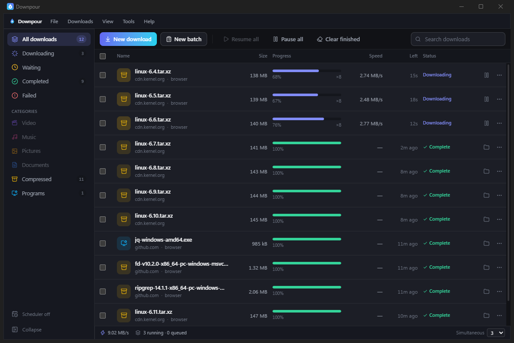

<div align="center">


# Downpour™

**The download manager for people who move large files for a living.**

Segmented multi-connection transfers, resume that will not corrupt a file,
browser hand-off with your session intact, batch capture, overnight scheduling
and bandwidth control — in a native Windows application that installs in
seconds and never asks for administrator rights.

[](https://github.com/ali-kin4/downpour/actions/workflows/ci.yml)
[](https://github.com/ali-kin4/downpour/releases/latest)
[](LICENSE)
[](https://github.com/ali-kin4/downpour/releases/latest)

### [⬇ Download for Windows](https://github.com/ali-kin4/downpour/releases/latest)

</div>

<div align="center">



</div>

---

## Download

All builds are on the **[latest release page](https://github.com/ali-kin4/downpour/releases/latest)**.

| | File | For |
|---|---|---|
| **Installer** | `Downpour_x.y.z_x64-setup.exe` | Everyone. About 4 MB. No administrator prompt. |
| **MSI package** | `Downpour_x.y.z_x64_en-US.msi` | Group Policy and managed deployment. |
| **Browser extension** | `downpour-extension-x.y.z.zip` | Optional. Hands downloads over from your browser. |
| **Checksums** | `checksums.txt` | SHA-256 for every file above. |

Requires **64-bit Windows 10 or 11**. Nothing else to install: Windows 11
already has the runtime the interface is drawn with, and on Windows 10 the
installer fetches it if it is missing. Idle memory use is around **30 MB**.

Downpour installs into your own user folder, not Program Files, which is why it
needs no elevation and why it can be removed cleanly from **Add or remove
programs**.

### The SmartScreen warning is expected

The installer is **not code-signed** — a certificate is a recurring cost this
project does not carry — so Microsoft Defender SmartScreen will show a blue
**"Windows protected your PC"** panel offering only **Don't run**.

Click **More info**, then **Run anyway**.

That is a real warning and clicking through them should not be a habit. If you
would rather verify than trust, every release ships `checksums.txt`:

```powershell
Get-FileHash .\Downpour_1.2.2_x64-setup.exe -Algorithm SHA256
```

The result should match the line for your file. Installers are built by a
GitHub Actions runner from a tagged commit, and the build log is public.

**Full deployment notes** — system requirements, where every file goes, changing
the install location, silent install, clean uninstall, and troubleshooting for
SmartScreen, antivirus false positives, port conflicts and corporate proxies:
**[`docs/install.md`](docs/install.md)**.

---

## What it does

You give Downpour a link — or forty links, or a page full of them — and it
pulls each file down over several connections at once, keeps a resumable record
on disk so a dropped connection costs seconds instead of gigabytes, and stays
out of the way.

### Speed

- **Segmented transfers.** Each file is fetched over multiple connections in
  parallel, up to 16, which routes around per-connection rate limits.
- **No slow tail.** When one segment finishes early, its capacity is handed to
  the segments still running instead of sitting idle until the last one
  crawls to the end.
- **Live measurement.** Per-download and aggregate throughput, with time
  remaining that reflects current conditions rather than an average since the
  start.

### Reliability

- **Resume that refuses to corrupt.** Progress is journalled as it is written.
  An interrupted transfer resumes from where it stopped; if the server cannot
  prove the file is unchanged, Downpour restarts it rather than stitching two
  different files together.
- **Integrity verification.** A file can carry an expected SHA-256, checked
  before the download is put into place. A mismatch fails the download instead
  of handing you a bad file.
- **Automatic retries** with backoff, and a clear failure reason when a
  download genuinely cannot proceed.
- **Nothing is written under the final name until it is complete**, so a
  half-file never masquerades as a finished one.

### Control

- **Bandwidth limits**, globally and inside scheduled windows, so a large queue
  does not take the network hostage during working hours.
- **Scheduling.** Queue work into time windows — overnight, off-peak — with a
  choice of what happens when the queue drains.
- **Queue management.** Reorder, pause and resume individually or in bulk, and
  cap how many downloads run at once.
- **Category folders.** Files sort themselves into Video, Music, Documents,
  Compressed, Programs and Pictures, or wherever you point them.

### Getting links in

- **Browser hand-off** with cookies, referer and user-agent attached, so
  session-gated files arrive as the file and not as a login page.
- **Batch paste.** Drop in a wall of URLs and filter before anything is queued.
- **Clipboard capture**, optionally limited to the file types you care about.
- **Link grabber** that pulls every downloadable link off a page for you to
  pick through.
- **Video pages.** Where a supported helper is present, media on a page can be
  captured at a chosen quality. See [`docs/media.md`](docs/media.md).

### The application itself

- **Native Windows interface** with light and dark themes, eleven colour
  schemes, and a table you can sort, resize and reorganise.
- **Tray operation**, optional launch at login, and a floating progress panel.
- **Completion notifications** on success and on failure.
- **Command palette** and keyboard-first navigation throughout.

---

## Browser integration

An optional extension for Chrome, Edge, Brave, Opera and Vivaldi hands
downloads from the browser to Downpour **with the session the browser would
have used** — which is what makes files behind a login arrive intact.

It talks to the application over an authenticated listener bound to your own
machine only. Pairing is a one-time step: copy the token from **Settings →
Browser integration** into the extension's settings and press **Test
connection**. Without that token nothing is accepted, so a web page cannot queue
downloads into your application.

The extension is on the [release page](https://github.com/ali-kin4/downpour/releases/latest);
installation and pairing are covered in [`extension/README.md`](extension/README.md).

---

## Known limits

Worth reading before you deploy this somewhere that matters.

**No client can make a server send data faster than it is willing to, or make
your connection wider than it is.** If a host caps you across all connections,
or your line is already saturated, Downpour is exactly as fast as anything else.
What it removes is client-side waste: idle connections at the end of a
transfer, restarting from zero after a dropped socket, a single stream against a
per-connection cap. On some downloads that is a large multiple; on others it is
nothing at all, and any tool promising otherwise is guessing.

Two limits that matter on a managed network:

- **Proxies** are read from the `HTTPS_PROXY` / `HTTP_PROXY` / `NO_PROXY`
  environment variables only — not from Internet Options, and not from a PAC
  script.
- **TLS trust** comes from a bundled root store rather than the Windows
  certificate store. **Behind a TLS-inspecting corporate proxy, downloads fail
  with a certificate error** even where the same URL works in the browser, and
  no setting corrects it today. Workarounds are in
  [`docs/install.md`](docs/install.md#downloads-fail-behind-a-corporate-proxy).

Torrent and magnet links are not supported and are not planned. Downpour is an
HTTP(S) download manager; BitTorrent is a different protocol and a different
program.

---

## Roadmap

Not built yet, and listed as direction rather than as a dated promise: code
signing, per-download bandwidth limits, a command-line interface, and builds for
platforms beyond Windows.

---

## Security

Downpour runs an authenticated listener bound to `127.0.0.1` so the browser
extension can reach it. That is the most security-relevant surface in the
product, and reports about it are firmly in scope — if you find a way around the
authentication, past the CORS policy, or onto any other interface, please report
it privately through
[GitHub Security Advisories](https://github.com/ali-kin4/downpour/security/advisories/new)
rather than opening a public issue.

Full policy, including the properties the listener is required to hold and what
is explicitly out of scope: [SECURITY.md](SECURITY.md).

---

## Licence

© 2026 Ali Jabbary. All rights reserved.

**Downpour is free to use — personally and at work, on as many machines as you
like, with no account and no payment. It is not free to take.** Redistributing
it, selling it, or shipping your own build of it is not permitted. See
[LICENSE](LICENSE); it is written to be read.

The source is published so that anyone can audit what a program that fetches
things from the internet actually does with their files and their network. That
is transparency, not a grant to reuse the code.

Versions up to and including 1.0.1 were released under the MIT Licence and
[stay that way permanently](LICENSE-MIT) — a granted licence cannot be
withdrawn.

### Trademark

**Downpour™, the Downpour name and the Downpour droplet logo are trademarks of
Ali Jabbary.** The licence governs the software; the marks are a separate right,
and it exists so that a build calling itself Downpour is Downpour.

Using the software, writing about it, and saying truthfully that your work
integrates with it need no permission. Releasing anything under this name, or a
name close to it, does. [TRADEMARK.md](TRADEMARK.md) sets out both.

Downpour downloads what you point it at. What you are permitted to download is
between you, the site's terms, and the law where you live.

---

<div align="center">

**Downpour™** — created, designed and developed by **[Ali Jabbary](https://alijabbary.com)**.

</div>
